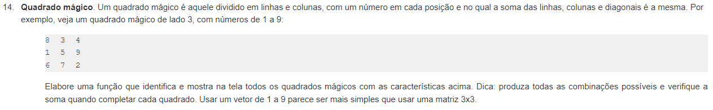

# Quadrado Mágico

### Solução do [exercício 14 da lista de exercícios de funções da python.org](https://wiki.python.org.br/ExerciciosFuncoes)

---

1. Baixe o código (clique no arquivo quadrado_magico.py acima, copie e cole o conteúdo no seu editor de código)
2. Esse código está completo e correto?
3. Como você melhoraria o código?
4. [Bônus] - abra uma issue nesse repositório dizendo como melhoraria o código, e posteriormente abrindo um Pull Request com a melhoria