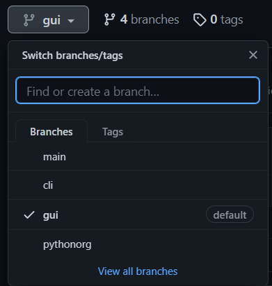

# Exercícios de Python

Repositório com exercícios para meus alunos em disciplinas contendo Python. Os exercícios são divididos em branches:

## 🌱 Branches:
 

 - main - branch atual
 - cli - programa com interface de linha de comando
 - pythonorg - exercícios do site Python.org Brasil [https://wiki.python.org.br/ListaDeExercicios]
