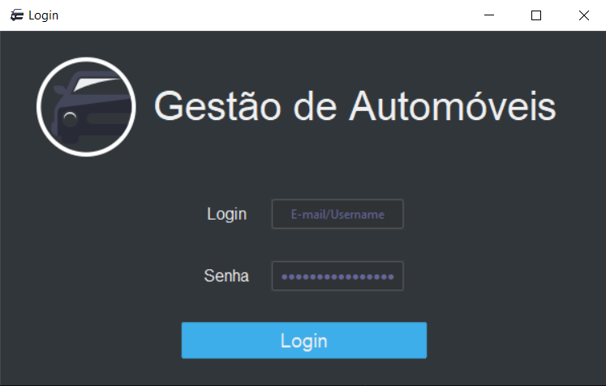

# Gestão GUI

## Proposta de Exercício para a prática de programação, usando Tkinter

 

 

## 🌱 Branches:
 

 - main - branch atual
 - cli - programa com interface de linha de comando
 - gui - programa baseado na cli, mas com interface gráfica
 - pythonorg - exercícios do site Python.org Brasil [https://wiki.python.org.br/ListaDeExercicios]